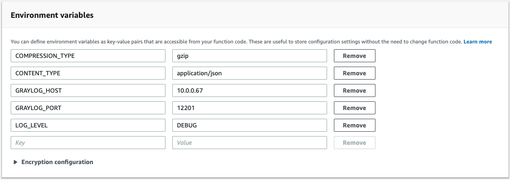
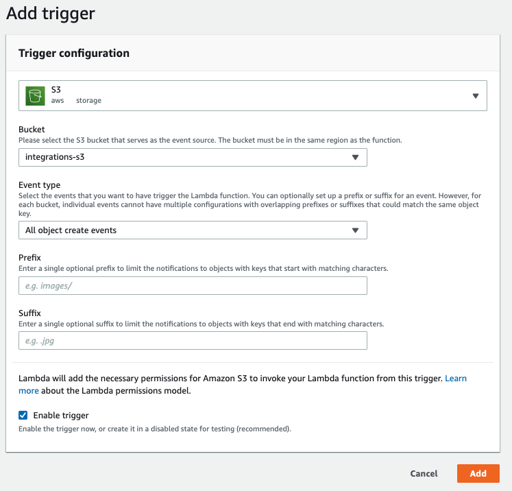

# Graylog S3 Lambda
An AWS Lambda function that reads log messages from AWS S3 and sends them to a Graylog GELF (TCP) input.

## Overview

The Graylog S3 Lambda function reads log files written to an S3 bucket and sends them to a Graylog cluster where a GELF 
(TCP or UDP) input is running. The function triggers automatically each time a new file is written to S3. With each 
function execution, each line in the file is streamed and processed by the Lambda function then sent to the specified 
Graylog node or cluster. Each line is considered a single message. Several log formats are supported. The `text/plain` 
CONTENT_TYPE can be used in combination with Graylog [Pipelines](https://docs.graylog.org/en/3.1/pages/pipelines/pipelines.html) 
for any log formats that are not directly supported.       

## Installation

### Step 1: Create base Lambda function and policy

Navigate to the Lambda service page in the AWS web console. Create a new Lambda function from and specify a function name of your choice, and choose the Java-8 runtime.
Create or specify an execution role with the following permissions. You can also further restrict the Resource permissions as desired for your specific setup.

```
{
    "Version": "2012-10-17",
    "Statement": [
        {
            "Sid": "Policy",
            "Effect": "Allow",
            "Action": [
                "logs:CreateLogGroup"
                "s3:GetObject",
                "logs:CreateLogStream",
                "logs:PutLogEvents"
            ],
            "Resource": [
                "arn:aws:logs:your-region:your-account-number:*"
                "arn:aws:s3:your-region::s3-bucket-name/*"
            ]
        }
    ]
}
```

NOTE: If your Graylog cluster is running in a VPC, you may need to add the AWSLambdaVPCAccessExecutionRole managed role to allow the Lambda function to route traffic to the VPC.

Once the function is created, upload the function code graylog-s3-lambda.jar located in the Preparation task section.  Specify the following method for the Handler: org.graylog.integrations.s3.GraylogS3Function::handleRequest

### Step 2: Specify configuration

Specify the following environment variables to configure the Lambda function for your Graylog cluster:

* `GRAYLOG_HOST`: *(required)* The hostname or IP address of the Graylog host or load balancer.
* `GRAYLOG_PORT`: *(optional - defaults to `12201`)*: The Graylog service port.
* `CONTENT_TYPE`: *(optional - defaults to `text/plain`)* The type of log messages to read. Messages will be parsed according to their content type. Supported values: `application/json`, `text/plain`, and `application/x.cloudflare.log`
* `COMPRESSION_TYPE`: *(optional - defaults to `none`)* The compression type. Supported values: `none`, `gzip`
* `CONNECT_TIMEOUT` *(optional - defaults to `10000`)* The number of milliseconds to wait for the connection to be established.
* `LOG_LEVEL` *(optional - defaults to `INFO`)* The level of detail to include in the CloudWatch logs generated from the Lambda function. Supported values are OFF, ERROR, WARN, INFO, DEBUG, TRACE, and ALL. Increase the logging level to help with troubleshooting. See this page for more information.
* `RECONNECT_DELAY`: *(optional - defaults to `10000`)* The number of milliseconds to wait between reconnection attempts.
* `TCP_KEEP_ALIVE`: *(optional - defaults to `true`)* Enable TCP Keep Alive.
* `TCP_NO_DELAY`: *(optional - defaults to `true`)* Enable TCP No Delay.
* `TCP_QUEUE_SIZE`: *(optional - defaults to `512`)* The queue size for messages that have yet to be sent. 
* `TCP_MAX_IN_FLIGHT_SENDS`: *(optional - defaults to `512`)* The maximum number of messages that can be in flight at one time.
* `PROTOCOL_TYPE`: *(optional - defaults to `tcp`)* The type of protocol. Supported values: `tcp` `udp`
* `SHUTDOWN_FLUSH_TIMEOUT_MS`: *(optional - defaults to `100`)* The number of milliseconds to wait or all messages to finish flushing/sending after message processing is complete.    
* `SHUTDOWN_FLUSH_RETRIES`: *(optional - defaults to `600`)* The number of times to retry the `SHUTDOWN_FLUSH_TIMEOUT_MS`. Increase this value if not all messages are sent by the time the Lambda function exits (only if the maximum Lambda function [timeout](https://docs.aws.amazon.com/lambda/latest/dg/resource-model.html) has not been reached ). 
* `CLOUDFLARE_LOGPUSH_MESSAGE_FIELDS`: *(optional - defaults to all fields in Cloudflare log JSON)* The fields to parse from the message. Specify as a comma-separated list of field names.
* `CLOUDFLARE_LOGPUSH_MESSAGE_SUMMARY_FIELDS `: *(optional - defaults to `ClientRequestHost, ClientRequestPath, OriginIP, ClientSrcPort, EdgeServerIP, EdgeResponseBytes`) The fields to include in the message summary that appears above the parsed fields at the top of each message in Graylog, specify as a comma-separated list of field names.

Note: 
All log messages are sent over TCP by default. TLS encryption between the Lambda function and Graylog is not currently supported. We recommend taking appropriate measures to secure the log messages in transit (such as placing the Lambda function within a secure VPC subnet where the Graylog node or cluster is running).



### Step 3: Create S3 trigger

Create an AWS S3 Trigger for the Lambda function so that the function can execute each Cloudflare log file that is written. Specify the same S3 bucket that you did in the Preparation step and make sure to choose All object create events option is selected. You can also apply any other desired file filters here.

If your Graylog cluster is located within a VPC, you will need to configure your Lambda function to access resources in a VPC.



### Step 4: Create GELF (TCP) input

Create a GELF (TCP) input on a Graylog node. You can create the input globally and put the nodes behind a TCP load balancer if load balancing is desired. 
